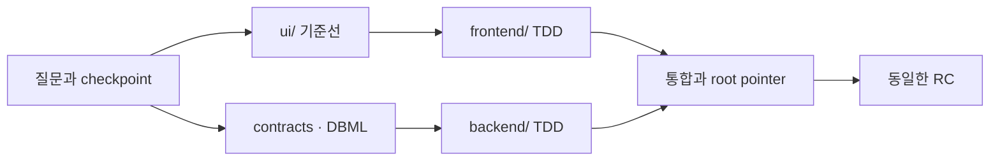

# Stackcord

> 질문으로 서비스를 정의하고, 여러 저장소와 여러 사람의 작업을 하나의 제품 맥락으로 연결하는 풀스택 협업 하네스.

[English](./README.md)

Stackcord는 Codex와 대화하며 사용하는 **Question-Driven Development(QDD)** 도구입니다. 프레임워크를 먼저 정하지 않고 서비스의 사용자·정책·실패 상황을 이해한 뒤, 필요한 기술과 협업 도구를 선택합니다.

사용자는 명령을 외울 필요가 없습니다. “새 서비스 시작해줘”, “이 기능 만들어줘”, “이 프로젝트 이어서 해”라고 말하면 됩니다. **Skill은 질문과 판단을 담당하고, 결정적인 검증기는 실제 Git·submodule·충돌·release 상태를 확인합니다.**

## 어떤 문제를 해결하나요?

| 문제 | Stackcord를 사용하면 |
| --- | --- |
| 사람과 AI마다 서비스의 목적·정책·동작을 다르게 이해함 | 목적·정책·scenario·contract·결정을 저장소의 공통 원본으로 정리합니다. |
| 긴 대화에서 AI가 이미 결정한 내용을 잊거나 다시 질문함 | 중요한 답변마다 제품 요약·정책·결정·미해결 질문을 갱신합니다. 원본 말투나 대화 전문은 저장하지 않습니다. |
| 보안·접근성·운영·권한·실패 복구 같은 요구사항이 빠짐 | 놓친 영역을 능동적으로 제시하되 결과를 크게 바꾸는 질문만 한 번에 하나씩 묻습니다. |
| 기존 Skill·Plugin·개발 방법·외부 도구를 몰라 처음부터 다시 만듦 | 현재 필요와 사용 가능한 도구를 확인하고 차이를 설명한 뒤 선택한 것만 연결합니다. |
| `ui/`·`frontend/`·`backend/`가 별도 저장소라 서로 다른 제품으로 흘러감 | 상위 orchestration 저장소가 공통 제품 의미·contract·통합 순서와 정확한 commit 조합을 관리합니다. |
| 일반 구현 중 승인되지 않은 사람이 서비스 방향까지 바꿈 | 팀원은 변경을 제안할 수 있지만 지정된 제품 책임자만 정책·contract·비즈니스 규칙을 승인합니다. |
| 서로 다른 파일에서 같은 정책·DB·UI 흐름을 바꿔 의미상 충돌함 | 파일 경로뿐 아니라 제품 의미의 겹침을 작업 전에 검사합니다. |
| 담당과 범위가 불분명해 중복 구현하거나 통합 직전에 충돌함 | checklist와 작업 범위를 연결하고 필요한 의미 범위만 Git에서 선점합니다. |
| Clone, AI 교체, context 압축 뒤 현재 상태와 다음 작업을 잃음 | 실제 Git·submodule·제품 원본과 fingerprint를 다시 읽어 상태와 다음 작업을 복구합니다. |

## 실제로는 이렇게 사용합니다

### 1. 질문으로 서비스를 정의합니다

```text
사용자: 새 예약 서비스를 시작해줘.
Stackcord: 예약이 확정되는 방식을 먼저 정해야 합니다.
A. 관리자가 승인하면 확정 (추천)
B. 결제가 완료되면 자동 확정
C. 신청 즉시 확정
직접 입력도 가능합니다.

사용자: A
Stackcord: 관리자 승인 방식으로 기록했습니다. 다음은 승인 전에 자리가 중복 배정되는 상황을 확인하겠습니다.
```

답변은 `specs/`에 제품 의미로 정리됩니다. 기술 스택은 기능·품질·팀·운영 조건이 드러난 뒤, 선택 시점의 공식 문서와 유지보수 상태를 확인해서 제안합니다.

### 2. 필요한 외부 도구를 그때 추천합니다

```text
사용자: 프론트와 백엔드를 세 명이 나눠서 개발할 거야.
Stackcord: 현재 GitHub를 사용하고 있으니 작업 상태 원본을 하나 정하겠습니다.
A. GitHub Issues + Git 선점 (추천)
B. Beads + Git 선점
C. Git-local

사용자: A
Stackcord: GitHub Issues는 담당과 진행 상태를, Stackcord는 정책·contract·DB·UI 충돌 범위를 관리하겠습니다.
```

Stackcord는 Superpowers·BMAD·Beads를 다시 만들지 않습니다. **사용자가 몰랐던 적절한 도구를 필요한 순간에 찾아 연결하고, 그 도구가 프로젝트 원본을 침범하지 않게 관리합니다.** 선택하지 않은 도구는 강제하지 않습니다.

### 3. 제품 방향은 승인된 사람만 확정합니다

```text
팀원: 환불 가능 시간을 24시간 전으로 바꿔줘.
Stackcord: 서비스 정책과 환불 contract가 바뀌는 작업입니다.
현재 계정은 제품 책임자가 아니므로 변경안·테스트·구현은 준비할 수 있지만 승인할 수는 없습니다.
Git 서비스에 PR을 만들고 제품 책임자의 검토를 요청할 수 있습니다.
```

로컬 Git 이름과 이메일은 권한으로 인정하지 않습니다. 선택한 Git 서비스의 실제 계정이 정확한 commit을 승인해야 합니다. 보호된 내용이 바뀌면 이전 승인은 오래된 상태가 됩니다.

## 질문에서 release까지

| 흐름 | Stackcord가 하는 일 |
| --- | --- |
| 시작·도입 | 새 프로젝트를 framework-neutral로 만들거나 기존 저장소를 덮어쓰지 않고 도입합니다. |
| 제품 발견 | 목적·역할·journey·정책·성공/실패 상황을 답변마다 checkpoint합니다. |
| UI·설계 | 전체 UI coverage를 먼저 보고 role·domain·journey별 작은 변경으로 나눕니다. 외부 목업은 reference·seed·canonical 중 역할을 정해 가져옵니다. |
| 계약·DB | 비즈니스 규칙, component contract, 실패 동작, Git DBML, migration·rollback 경계를 정합니다. |
| 계획·구현 | checklist, 담당 범위, merge 순서를 정하고 동작·bug·contract·migration·UI interaction을 TDD로 개발합니다. |
| 통합·복구 | child commit을 검토한 뒤 root pointer를 갱신하고, clone이나 context 압축 뒤에도 현재 상태를 재구성합니다. |
| Release | 기술 근거와 사용자 확인이 같은 RC를 가리키는지 검증합니다. |



Waterfall처럼 모든 문서를 끝낸 뒤 한꺼번에 구현하지 않습니다. 제품 전체 의미와 UI 범위는 먼저 공유하지만, 실제 개발은 작게 나누고 계속 통합합니다.

## Git·submodule 협업 구조

```text
project/                  # orchestration root: 제품 의미와 통합 commit
├── ui/                   # 선택형 UI directory 또는 submodule
├── frontend/             # 독립 저장소/submodule
├── backend/              # 독립 저장소/submodule
├── specs/                # 목적·정책·scenario·결정
├── contracts/            # 비즈니스·동작·interface·data 규약
└── .harness/             # 검증 가능한 협업 상태
```

| 협업 시점 | 확인하는 것 |
| --- | --- |
| 작업 시작 | branch·dirty·ahead/behind·diverged·worktree·submodule 상태와 기존 선점을 확인합니다. |
| 동시에 개발 | path와 정책·scenario·contract·DB entity·migration·UI flow·dependency·pointer의 겹침을 비교합니다. |
| 충돌 위험 발견 | 담당·구현 경계·merge 순서를 먼저 정하거나 worktree로 격리합니다. |
| child 작업 완료 | child commit을 먼저 검토하고 root가 기록한 submodule pointer를 갱신합니다. |
| 다른 사람이 clone | submodule을 받은 뒤 Stackcord가 공통 원본·실제 Git·남은 작업을 복구합니다. |

브랜치와 커밋은 `feature/account-recovery`, `feat(account): add recovery challenge` 같은 일반 Git convention을 사용합니다. AI·agent·model 표시는 넣지 않습니다.

## 무엇을 실제로 검증하나요?

| 검증 영역 | 차단하는 문제 |
| --- | --- |
| Git·submodule | dirty/diverged 저장소, 누락된 child, root pointer와 child HEAD 불일치 |
| 작업·충돌 | 중복 선점, stale 상태, 서로 다른 파일에서 발생한 의미 충돌, 잘못된 merge 순서 |
| 제품 원본 | 변경된 policy·contract·DBML·UI flow, 오래되거나 권한 없는 승인 |
| 개발 근거 | TDD 실패/통과 근거, contract consumer, migration·rollback 누락 |
| Release | 서로 다른 commit을 본 기술 검증과 사용자 승인, 검증 뒤 변조된 RC |

Stackcord는 AI의 판단을 사실처럼 신뢰하지 않고 저장소에서 다시 계산 가능한 상태를 검증합니다. 다만 실제 merge 권한은 GitHub·GitLab 같은 Git 서비스의 branch protection과 CODEOWNERS가 집행합니다.

## 설치

Go나 내부 CLI를 알 필요가 없습니다. GitHub에 공개된 Stackcord 저장소 링크를 Codex에 붙여 넣고 이렇게 요청합니다.

```text
이 GitHub 링크의 Stackcord Plugin을 설치하고, 현재 프로젝트를 시작할 준비를 해줘.
```

보안 확인이 나타나면 설치를 승인하고 새 대화에서 “새 서비스를 같이 시작해줘”라고 말합니다. 직접 설치가 필요할 때만 `codex plugin marketplace add <owner>/stackcord`를 사용합니다.

Plugin이 없어도 생성된 프로젝트의 repo-local Skill과 Markdown fallback으로 다른 Codex 환경에서 이어갈 수 있습니다.

## 프로젝트에 남는 주요 파일

| 경로 | 내용 |
| --- | --- |
| `specs/` | 제품 요약·정책·scenario·결정·미해결 질문 |
| `contracts/registry.yaml` | 서비스 규칙과 component 사이 contract의 인덱스 |
| `.harness/workspaces.yaml` | root·UI·frontend·backend 저장소 관계 |
| `.harness/work/provider.yaml` | 선택한 live task 상태 원본 |
| `.harness/governance.yaml` | 제품 책임자와 보호할 제품 의미 |
| `.harness/local/context/` | Git에 올리지 않고 언제든 재생성할 수 있는 context cache |
| `.agents/skills/use-project-harness/` | Plugin 없이 프로젝트를 이어가기 위한 repo-local Skill |

사용자에게 보이는 다섯 Skill은 `start-project`, `continue-project`, `plan-project-work`, `coordinate-project-work`, `recover-and-release-project`입니다. 이름을 외울 필요는 없습니다. 기본 mode는 일반 팀 협업에 필요한 검증만 제공하며, `strict-release`는 선택한 조직에만 SBOM·provenance·signature 같은 강한 공급망 검증을 추가합니다.

## 더 알아보기

| 하고 싶은 일 | 문서 |
| --- | --- |
| 시작하거나 기존 프로젝트에 도입 | [시작](./docs/getting-started/ko.md) |
| UI·frontend·backend 분리 협업 | [UI workspace](./docs/guides/ui-workspace-ko.md) · [Submodule](./docs/guides/submodules-ko.md) |
| 작업·충돌·제품 책임자 관리 | [작업 관리](./docs/guides/task-management-ko.md) · [제품 책임자](./docs/guides/governance-ko.md) |
| DB 설계와 release | [DBML](./docs/guides/dbdiagram-ko.md) · [Release](./docs/guides/release-ko.md) |
| 문제 해결 | [문제 해결](./docs/guides/troubleshooting-ko.md) |
