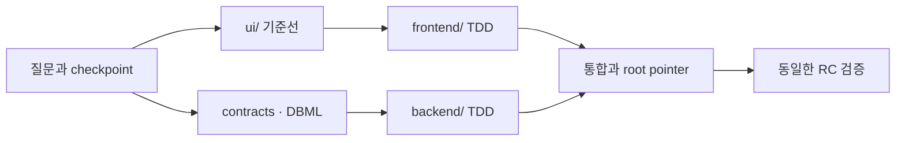

# Stackcord

> 질문으로 서비스를 정의하고, 알맞은 개발 방식과 협업 도구를 선택하며, 풀스택 프로젝트의 맥락을 release까지 이어주는 협업 하네스.

[English](./README.md)

Stackcord는 Codex와 대화하며 사용하는 **Question-Driven Development(QDD)** 도구입니다. 기술 스택을 먼저 강제하지 않고 서비스의 사용자·정책·실패 상황을 정리한 뒤, `ui/`·`frontend/`·`backend/`가 별도 저장소여도 하나의 제품처럼 개발하고 검증합니다.

사용자는 명령을 외우지 않습니다. Codex에서 “새 서비스 시작해줘”, “이 기능 만들어줘”, “이 프로젝트 이어서 해”라고 말하면 됩니다. Stackcord의 Skill이 질문과 판단을 담당하고, 내부 검증기가 실제 Git·submodule·충돌·release 상태를 확인합니다.

## 어떤 문제를 해결하나요?

| 일반적인 문제 | Stackcord를 사용하면 |
| --- | --- |
| 사람과 AI마다 서비스의 목적·정책·동작을 다르게 이해함 | 목적·정책·scenario·contract·결정을 저장소의 공통 원본으로 정리해 누가 어떤 AI를 쓰더라도 같은 기준에서 개발합니다. |
| 긴 서비스 발견 대화에서 이미 결정한 내용을 AI가 잊거나 다시 질문함 | 중요한 답변을 제품 요약·정책·결정·미해결 질문으로 계속 저장합니다. |
| 보안·접근성·운영·권한·실패 복구처럼 처음 떠올리기 어려운 요구사항이 빠짐 | 제품 coverage의 빈 영역을 확인하고 결과를 바꾸는 문제만 능동적으로 제안합니다. |
| 존재하는 Skill·Plugin·개발 방법·외부 도구를 몰라 처음부터 다시 만듦 | 현재 필요와 설치된 도구를 확인하고, 알맞은 후보의 차이를 설명한 뒤 선택한 것만 연결합니다. |
| `ui/`·`frontend/`·`backend/`가 별도 저장소라 서로 다른 제품을 개발함 | 상위 orchestration 저장소가 공통 제품 의미·contract·기준선·통합 순서와 정확한 commit 조합을 관리합니다. |
| 일반 구현 중 승인되지 않은 사람이 서비스 방향까지 바꿈 | 일반 팀원은 변경을 제안할 수 있지만 지정된 제품 책임자만 정책·contract·비즈니스 규칙을 승인합니다. |
| 서로 다른 파일에서 같은 정책·contract·DB·UI 흐름을 바꿈 | path뿐 아니라 제품 의미의 겹침을 작업 전에 찾아 담당과 merge 순서를 정합니다. |
| 담당과 범위가 불분명해 같은 기능을 중복 구현하거나 통합 직전에 충돌함 | 작업 checklist와 의미 범위를 연결하고 필요한 작업만 Git에서 선점합니다. |
| Clone, AI 교체, context 압축 뒤 현재 상태와 다음 작업을 잃음 | 실제 Git·submodule·제품 원본과 fingerprint를 다시 읽어 상태와 다음 작업을 복구합니다. |

## Codex에서 이렇게 사용합니다

Plugin을 설치한 Codex 대화에서 시작합니다. Stackcord는 결과를 크게 바꾸는 질문만 한 번에 하나씩 묻습니다.

```text
사용자: 새 예약 서비스를 시작해줘.

Stackcord: 예약이 확정되는 방식을 먼저 정해야 합니다.

A. 관리자가 승인해야 확정 (추천)
B. 결제가 완료되면 자동 확정
C. 신청 즉시 확정
직접 입력도 가능합니다.

사용자: A

Stackcord: 관리자 승인 방식으로 기록했습니다.
승인 전에 같은 자리가 다른 사용자에게 배정되는 상황을 다음으로 확인하겠습니다.
```

| 대화에서 나온 내용 | 저장되는 결과 |
| --- | --- |
| 서비스 목적·사용자·핵심 journey | `specs/`의 정규화된 제품 설명 |
| “관리자 승인 후 확정” | 서비스 정책과 결정 |
| 중복 예약·결제 실패 같은 상황 | 성공·실패 scenario |
| 아직 답하지 않은 중요한 문제 | open questions |

원본 대화와 말투는 저장하지 않습니다. 개발에 필요한 의미만 정리하며, 다음 사람이 clone해도 같은 기준을 읽을 수 있습니다.

제품 방향은 별도로 보호할 수 있습니다.

```text
팀원: 환불 가능 시간을 24시간 전으로 바꿔줘.

Stackcord: 이 변경은 서비스 정책과 환불 contract를 바꿉니다.
현재 Git 계정은 제품 책임자가 아니므로 변경안·테스트·구현은 준비할 수 있지만 승인할 수는 없습니다.
선택한 Git 서비스에 PR을 만들고 제품 책임자의 검토를 요청하겠습니다.
```

Git의 표시 이름이나 이메일은 쉽게 바꿀 수 있으므로 권한으로 인정하지 않습니다. 선택된 Git 서비스의 실제 계정이 정확한 commit을 승인해야 하며, 이후 정책이나 contract가 달라지면 기존 승인은 자동으로 오래된 상태가 됩니다.

## 질문에서 release까지

| 단계 | 사용자가 하는 말 | Stackcord가 하는 일 |
| --- | --- | --- |
| 시작 | “새 서비스 시작해줘” 또는 “기존 프로젝트에 적용해줘” | 파일·Git·기존 설정을 읽고 비파괴적으로 시작합니다. |
| 제품 정의 | 객관식 또는 자유 답변 | 제품 의미·정책·scenario를 답변마다 checkpoint합니다. |
| 설계 | “UI부터 정리해줘” | 역할·journey별 UI coverage와 contract·DBML 경계를 정합니다. |
| 작업 계획 | “계정 복구 기능 만들어줘” | checklist, TDD 순서, 담당 범위와 merge 순서를 정합니다. |
| 구현·통합 | 자연어로 계속 요청 | 작은 변경으로 개발하고 contract, migration, submodule pointer 순서로 통합합니다. |
| 복구 | “이 프로젝트 이어서 해” | 실제 저장소 상태로 context를 재구성하고 다음 작업 하나를 제안합니다. |
| 출시 | “release 준비해줘” | 기술 검증과 사용자 확인을 같은 RC에 연결합니다. |



Waterfall처럼 전체 문서를 끝낸 뒤 한꺼번에 구현하지 않습니다. 제품 전체의 역할·journey·UI 범위를 먼저 이해하되, 실제 변경은 작은 role·domain·journey 단위로 나누어 계속 통합합니다.

## 필요한 방식과 협업 도구도 그때 추천합니다

Stackcord가 Superpowers, BMAD, Beads를 다시 만드는 것은 아닙니다. 필요한 순간에 현재 저장소와 설치된 도구를 확인하고, 현실적인 후보만 비교한 뒤 사용자가 고른 것만 연결합니다.

```text
사용자: 프론트와 백엔드를 세 명이 나눠서 개발할 거야.

Stackcord: 현재 GitHub를 사용하고 있어 작업 상태 원본을 정해야 합니다.

A. GitHub Issues + Git 선점 (추천) — 기존 GitHub에서 담당자와 상태 확인
B. Beads + Git 선점 — dependency가 복잡한 분산 작업에 적합
C. Git-local — 별도 서비스 없이 가볍게 시작

사용자: A

Stackcord: GitHub Issues는 진행 상태를, Stackcord는 정책·contract·DB·UI 충돌 범위를 관리하겠습니다.
```

| 필요한 것 | 제안할 수 있는 선택 | Stackcord가 계속 관리하는 것 |
| --- | --- | --- |
| 설계·TDD·debug·review 규율 | Superpowers | 서비스 의미와 실제 저장소 상태 |
| 역할·PRD·story 중심의 상세한 절차 | BMAD | Git·submodule·contract·release identity |
| 작업 상태와 dependency | Git-local, GitHub Issues, Jira, Beads | 실행 checklist와 의미 범위 선점 |
| UI 제작과 협업 | Figma, Penpot, UI Skill | 승인된 `ui/` commit과 frontend 기준선 |
| DB 시각화 | dbdiagram CLI | Git DBML, migration과 rollback 근거 |

## 주요 기능

| 상황 | Stackcord가 하는 일 | 결과 |
| --- | --- | --- |
| 새 프로젝트 또는 기존 저장소 | framework-neutral init/adopt | 기존 파일을 덮어쓰지 않는 하네스 |
| 긴 서비스 발견 대화 | 중요한 답변마다 정규화 checkpoint | 반복 질문과 context 손실 감소 |
| 기술 선택 시점 | 기능·품질·팀·운영 조건과 최신 공식 근거 비교 | 이유와 재검토 조건이 있는 결정 |
| 외부 UI 목업 | reference·seed·canonical 권한을 확인하고 선택 파일 또는 전체를 가져옴 | 수정 가능한 UI workspace와 provenance |
| contract·DB 변경 | provider/consumer, 실패 동작, DBML과 migration 영향 확인 | 구현 순서와 호환성 경계 |
| 제품 정책·비즈니스 규칙 변경 | Git 계정 기반 제품 책임자와 정확한 commit 승인 확인 | 일반 팀원의 제안은 허용하면서 승인 없는 방향 변경 차단 |
| 동시 작업 | worktree 선택, 의미 범위 선점, compare-and-swap | 중복 구현과 조용한 충돌 방지 |
| clone·중단·context 압축 | stable ID·fingerprint·Git 상태 재계산 | confirmed·stale·unknown 복구 |
| release 준비 | TDD evidence, pointer, contract, migration, 사용자 확인 결합 | 하나의 검증 가능한 candidate |

## Git·submodule 협업 구조

```text
project/                  # orchestration root: 제품 의미와 통합 commit
├── ui/                   # 선택형 UI directory 또는 submodule
├── frontend/             # 독립 제품 저장소/submodule
├── backend/              # 독립 제품 저장소/submodule
├── specs/
├── contracts/registry.yaml
└── .harness/
```

| 협업 시점 | 안전장치 |
| --- | --- |
| 작업 시작 전 | branch·dirty·ahead/behind·diverged·worktree·submodule 상태를 확인합니다. |
| 여러 작업이 겹칠 때 | path와 정책·scenario·contract·DB·UI·dependency·pointer 범위를 비교합니다. |
| 겹침이 발견될 때 | 소유권·구현 경계·merge 순서를 합의하기 전에는 작업을 시작하지 않습니다. |
| child 작업 완료 후 | child commit을 먼저 검토한 뒤 root submodule pointer를 갱신합니다. |
| 다른 사람이 clone할 때 | `git submodule update --init --recursive` 후 Stackcord가 전체 상태를 복구합니다. |

브랜치와 커밋은 `feature/account-recovery`, `feat(account): add recovery challenge`처럼 일반 convention을 사용합니다. 이름에 AI·agent·model 표시를 넣지 않습니다.

## 설치

일반 사용자는 Go나 내부 CLI를 설치할 필요가 없습니다. 이 저장소의 GitHub 링크를 Codex에 붙여 넣고 다음처럼 요청합니다.

```text
이 GitHub 링크의 Stackcord Plugin을 설치하고 이 프로젝트를 시작할 준비를 해줘.
<Stackcord GitHub URL>
```

Codex가 marketplace 등록과 설치를 진행하며, 보안 확인이 필요하면 사용자가 설치를 승인합니다. 설치가 끝나면 새 대화에서 “새 서비스를 같이 시작해줘”라고 말합니다.

직접 설치해야 할 때만 다음 fallback을 사용합니다.

```bash
codex plugin marketplace add <owner>/stackcord
```

그다음 Codex의 **Plugins**에서 Stackcord를 설치합니다. Plugin이 없어도 생성된 저장소의 `.agents/skills/use-project-harness/`와 Markdown fallback으로 이어갈 수 있습니다.

## 생성되는 파일과 모드

| 경로 | 역할 |
| --- | --- |
| `specs/` | 제품 요약·정책·scenario·결정·미해결 질문 |
| `contracts/registry.yaml` | component 사이 규약, 실패 동작, provider/consumer 관계 |
| `.harness/workspaces.yaml` | root·UI·frontend·backend topology |
| `.harness/work/provider.yaml` | 선택한 live task 원본 하나 |
| `.harness/governance.yaml` | 제품 책임자와 보호할 제품 의미의 범위 |
| `.harness/local/context/` | Git에서 제외되고 다시 만들 수 있는 context cache |
| `.agents/skills/use-project-harness/` | Plugin 없이도 사용할 수 있는 repo-local Skill |

사용자에게 보이는 Skill은 `start-project`, `continue-project`, `plan-project-work`, `coordinate-project-work`, `recover-and-release-project` 다섯 개입니다. 사용자가 직접 Skill 이름을 외울 필요는 없습니다.

기본 mode는 Git 계정 기반 제품 책임자, TDD, 충돌·통합·migration/rollback, 동일 RC 검증을 제공합니다. `strict-release`는 조직이 선택할 때만 SBOM·provenance·signature와 다중·서명 승인을 추가합니다.

## 더 알아보기

| 하고 싶은 일 | 문서 |
| --- | --- |
| 처음 시작하거나 기존 프로젝트에 적용 | [시작](./docs/getting-started/ko.md) |
| UI·frontend·backend를 나눠 협업 | [UI workspace](./docs/guides/ui-workspace-ko.md) · [Submodule](./docs/guides/submodules-ko.md) |
| 작업 담당·충돌·제품 책임자 관리 | [작업 관리](./docs/guides/task-management-ko.md) · [제품 책임자](./docs/guides/governance-ko.md) |
| DB 설계와 release 준비 | [DBML](./docs/guides/dbdiagram-ko.md) · [Release](./docs/guides/release-ko.md) |
| 문제가 생겼을 때 | [문제 해결](./docs/guides/troubleshooting-ko.md) |
