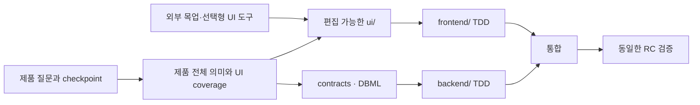

# 풀스택 프로젝트 하네스

> 공개 이름은 출시 전에 결정합니다. 현재 패키지는 Codex를 우선 지원합니다.

[English](./README.md)

AI와 자연어로 서비스를 정의하고, 기술을 미리 강제하지 않은 채 `ui/`·`frontend/`·`backend/` 저장소를 만들고 연결하며, 다른 사람이 clone해도 정확한 상태에서 개발과 release를 이어가게 하는 프로젝트 하네스입니다.

## 이걸 쓰면 달라지는 점

- 긴 제품 대화가 제품 요약·정책·시나리오·결정·미해결 질문으로 계속 저장됩니다.
- 외부 목업을 가져와 `ui/`에서 직접 수정하고, 정확한 UI 커밋을 기준으로 프런트를 구현할 수 있습니다.
- Git·submodule·worktree와 작업 선점으로 파일뿐 아니라 정책·contract·DB·UI 의미 충돌을 일찍 찾습니다.
- clone이나 context 압축 후에도 실제 저장소 상태를 복구하고 동일한 release candidate를 검증합니다.

## 사용 방법

명령을 외울 필요 없이 Codex에게 말합니다.

```text
“새 서비스를 같이 시작해줘.”
“기존 프로젝트에 도입하고 지금 상태를 파악해줘.”
“이 프로젝트 이어서 해. 다음으로 뭐 해야 해?”
```

Skill이 대화와 판단을 담당하고 Go CLI가 실제 Git 상태·동일성·안전·충돌만 결정적으로 검증합니다.



## 주요 기능

| 기능 | 효과 |
| --- | --- |
| 서비스 발견 checkpoint | 원본 대화 대신 정리된 제품 의미를 저장하고 중요한 질문만 하나씩 진행합니다. |
| Framework-neutral 시작·도입 | 새 프로젝트를 만들거나 기존 저장소를 덮어쓰지 않고 하네스를 추가합니다. |
| 편집 가능한 UI workspace | 목업을 `reference`·`seed`·`canonical`로 판단하고 전체 또는 일부를 가져와 수정합니다. |
| Git 협업 진단 | branch, dirty, ahead/behind, divergence, worktree, submodule HEAD와 root pointer를 확인합니다. |
| 의미 충돌과 작업 선점 | path 외에 정책·scenario·contract·DB entity·migration·UI flow·dependency·pointer 겹침을 찾습니다. |
| Contract·DBML | 서비스 규약과 실패 동작을 관리하고 Git DBML과 격리된 dbdiagram 제안을 비교합니다. |
| Context 복구 | stable ID와 fingerprint로 clone·중단·압축 뒤 확정·stale·unknown 상태를 다시 계산합니다. |
| 정확한 release | 기술 검증과 사용자 확인을 같은 root/UI/frontend/backend candidate에 연결합니다. |

사용자에게 보이는 Skill은 다섯 개뿐입니다: `start-project`, `continue-project`, `plan-project-work`, `coordinate-project-work`, `recover-and-release-project`.

## 5분 안에 로컬에서 시작

Go 1.26 이상이 필요합니다.

```bash
cd cli
go test ./...
go build -o ../bin/orchestrator ./cmd/orchestrator
cd ..
./bin/orchestrator doctor --json
```

Windows PowerShell:

```powershell
cd cli
go test ./...
go build -o ..\bin\orchestrator.exe .\cmd\orchestrator
cd ..
.\bin\orchestrator.exe doctor --json
```

Codex Plugin을 로컬 marketplace로 추가하려면 다음을 실행하고 Codex를 재시작한 뒤 Plugins에서 설치합니다.

```bash
codex plugin marketplace add /absolute/path/to/fullstack-orchestrator
```

Plugin 없이도 생성된 저장소의 `.agents/skills/use-project-harness/`와 Markdown fallback으로 계속할 수 있습니다.

## 실제 프로젝트 흐름

1. 저장소와 도구를 진단하고 중요한 제품 답변을 checkpoint합니다.
2. 제품 전체의 역할·journey·UI coverage를 보되 작은 역할·도메인·journey 변경으로 계속 통합합니다.
3. 필요하면 기존 원격 저장소를 `ui/` submodule로 추가하고 workspace로 등록합니다.
4. 외부 목업을 안전하게 검사한 뒤 전체 또는 선택 파일을 `ui/`로 가져와 일반 파일처럼 수정합니다.
5. UI 커밋을 게시하고 기준선으로 묶은 뒤 `frontend/` 작업이 그 fingerprint를 사용하게 합니다.
6. 공유 contract·DBML 경계를 합의하고 frontend/backend를 TDD로 구현합니다.
7. child 커밋을 검토한 뒤 root pointer를 통합하고 하나의 RC를 기술·사용자 양쪽에서 확인합니다.

MengTo/Skills 같은 UI Skill, Figma, Penpot, Superpowers, BMAD, GitHub Issues, Jira, Beads는 필요할 때 선택할 수 있습니다. 이들은 제작이나 작업 상태를 돕지만 서비스 원본과 release identity를 대신하지 않습니다.

## 생성되는 핵심 구조

```text
project/
├── specs/                         # 제품 의미·정책·시나리오
├── contracts/registry.yaml        # 서비스 규약과 provider/consumer
├── ui/                            # 선택형 편집 가능 UI directory/submodule
├── frontend/                      # 실제 프런트 제품
├── backend/                       # 실제 백엔드 제품
├── .agents/skills/use-project-harness/
└── .harness/
    ├── workspaces.yaml
    ├── work/provider.yaml
    ├── ui/baselines/
    └── local/context/             # Git에서 제외되는 재생성 cache
```

`.harness/`는 보통 사용자가 직접 편집하지 않습니다. AI가 상태를 요약하고 안전한 변경을 계획합니다. Git 협업에서는 `feature/account-recovery`, `feat(account): add recovery challenge` 같은 일반 convention을 사용하며 branch와 commit 이름에 AI 흔적을 넣지 않습니다.

재생성 가능한 context cache의 실제 위치는 Git에서 제외되는 `.harness/local/context/`입니다.
선택한 live task 원본은 `.harness/work/provider.yaml`에 기록됩니다.

## 기본 mode와 strict release

기본 mode는 일반 팀을 위한 Git identity, TDD, 통합, migration/rollback, 동일 RC 검증만 요구합니다. `strict-release`는 조직이 명시적으로 선택할 때만 SBOM·provenance·signature·강한 승인 정책을 추가합니다.

## 자세한 문서

- [시작 가이드](./docs/getting-started/ko.md)
- [UI workspace와 외부 목업](./docs/guides/ui-workspace-ko.md)
- [Submodule과 협업](./docs/guides/submodules-ko.md)
- [작업 관리와 작업 선점](./docs/guides/task-management-ko.md)
- [DBML과 dbdiagram](./docs/guides/dbdiagram-ko.md)
- [Release](./docs/guides/release-ko.md)
- [문제 해결](./docs/guides/troubleshooting-ko.md)
- [개발과 검증 정책](./CONTRIBUTING.md)

실제 공개 전에는 최종 이름·identifier, 공개 저장소/account, 필요한 경우 signing 소유권, 되돌릴 수 없는 배포 승인만 결정하면 됩니다.
