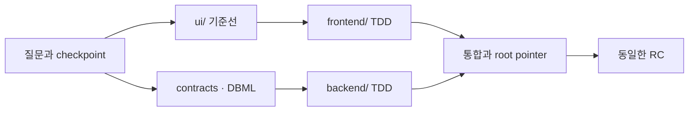

# Stackcord

> 사람, AI 에이전트, 여러 저장소가 같은 제품 결정을 바탕으로 일하도록 연결합니다.

[](https://github.com/kcrmin/Stackcord/actions/workflows/ci.yml)
[](./LICENSE)
[](https://github.com/kcrmin/Stackcord/releases/latest)


[English](./README.md)

Stackcord는 AI Skill이 **Question-Driven Development(QDD)**를 안내하고 Go CLI가 실제 저장소 상태를 검증하는 오픈소스 풀스택 협업 하네스입니다. 대화를 제품 결정으로 기록하고, 여러 저장소의 작업을 조정하며, 대화가 끝나거나 담당자가 바뀌어도 맥락을 복구합니다. 프레임워크를 고르기 전에 사용자·정책·실패 상황부터 이해합니다.

사용자는 명령을 외울 필요가 없습니다. “새 서비스 시작해줘”, “이 기능 만들어줘”, “이 프로젝트 이어서 해”라고 말하면 됩니다. **Skill은 질문과 판단을 담당하고, 결정적인 검증기는 실제 Git·submodule·충돌·release 상태를 확인합니다.**

[빠른 시작](#빠른-시작) · [제품 흐름](#질문에서-release까지) · [문서](#더-알아보기) · [기여](#개발과-기여)

## 빠른 시작

Codex에 [저장소 링크](https://github.com/kcrmin/Stackcord)를 붙여 넣고 요청합니다.

```text
이 GitHub 링크의 Stackcord Plugin을 설치하고, 현재 프로젝트를 시작할 준비를 해줘.
```

설치 보안 확인이 나타나면 승인한 뒤 새 대화를 시작합니다. 공개된 버전을 직접 설치할 때는 다음 명령을 사용합니다.

```bash
codex plugin marketplace add kcrmin/Stackcord --ref v1.0.0
codex plugin add stackcord@stackcord
```

빈 상위 폴더에서는 **“새 서비스를 같이 시작해줘”**, 기존 저장소에서는 **“내 파일을 덮어쓰지 않고 이 프로젝트에 도입해줘”**라고 말합니다. 제품 질문에 답한 뒤 **“프로젝트 맥락을 점검하고 다음 작업을 알려줘”**라고 요청하세요. 합의한 결정은 저장소 파일이 되어 다른 대화에서도 이어갈 수 있습니다.

태그 버전은 고정된 배포본이며 이 README는 현재 `main`의 기능도 설명합니다. 최신 소스 설치, CLI 준비, 플랫폼별 번들 및 SHA-256 검증은 [시작 안내](./docs/getting-started/ko.md)를 참고하세요. Hook은 소프트웨어를 다운로드하거나 설치하지 않습니다. 생성된 프로젝트는 Plugin 없이도 repo-local Skill과 Markdown fallback으로 이어갈 수 있습니다.

## 어떤 문제를 해결하나요?

| 문제 | Stackcord를 사용하면 |
| --- | --- |
| 사람과 AI마다 서비스의 목적·정책·동작을 다르게 이해함 | 목적·정책·scenario·contract·결정을 저장소의 공통 원본으로 정리합니다. |
| 긴 대화에서 AI가 이미 결정한 내용을 잊거나 다시 질문함 | 중요한 답변마다 제품 요약·정책·결정·미해결 질문을 갱신합니다. 원본 말투나 대화 전문은 저장하지 않습니다. |
| 보안·접근성·운영·권한·실패 복구 같은 요구사항이 빠짐 | 놓친 영역을 능동적으로 제시하고, 독립적인 일반 질문은 묶어서 물으며 질문 진행 상황을 보여줍니다. |
| 기존 Skill·Plugin·개발 방법·외부 도구를 몰라 처음부터 다시 만듦 | 현재 필요와 사용 가능한 도구를 확인하고 차이를 설명한 뒤 선택한 것만 연결합니다. |
| `ui/`·`frontend/`·`backend/`가 별도 저장소라 서로 다른 제품으로 흘러감 | 상위 orchestration 저장소가 공통 제품 의미·contract·통합 순서와 정확한 commit 조합을 관리합니다. |
| 일반 구현 중 승인되지 않은 사람이 서비스 방향까지 바꿈 | 팀원은 변경을 제안할 수 있지만 지정된 제품 책임자만 정책·contract·비즈니스 규칙을 승인합니다. |
| 서로 다른 파일에서 같은 정책·DB·UI 흐름을 바꿔 의미상 충돌함 | 파일 경로뿐 아니라 제품 의미의 겹침을 작업 전에 검사합니다. |
| 담당과 범위가 불분명해 중복 구현하거나 통합 직전에 충돌함 | checklist와 작업 범위를 연결하고 필요한 의미 범위만 Git에서 선점합니다. |
| Clone, AI 교체, context 압축 뒤 현재 상태와 다음 작업을 잃음 | 실제 Git·submodule·제품 원본과 fingerprint를 다시 읽어 상태와 다음 작업을 복구합니다. |

## 실제로는 이렇게 사용합니다

### 1. 질문으로 서비스를 정의합니다

```text
사용자: 예약 서비스도 필요할 것 같아.
Stackcord: 예약이 확정되는 방식을 먼저 정해야 합니다.
A. 관리자가 승인하면 확정 (추천)
B. 결제가 완료되면 자동 확정
C. 신청 즉시 확정
직접 입력도 가능합니다.

사용자: A
Stackcord: 관리자 승인 방식으로 기록했습니다. 다음은 승인 전에 자리가 중복 배정되는 상황을 확인하겠습니다.
```

답변은 `specs/`에 제품 의미로 정리됩니다. 기술 스택은 기능·품질·팀·운영 조건이 드러난 뒤, 선택 시점의 공식 문서와 유지보수 상태를 확인해서 제안합니다.

### 2. 필요한 외부 도구를 그때 추천합니다

```text
사용자: 프론트와 백엔드를 세 명이 나눠서 개발할 거야.
Stackcord: 현재 GitHub를 사용하고 있으니 작업 상태 원본을 하나 정하겠습니다.
A. GitHub Issues + Git 선점 (추천)
B. Beads + Git 선점
C. Git-local

사용자: A
Stackcord: GitHub Issues는 담당과 진행 상태를, Stackcord는 정책·contract·DB·UI 충돌 범위를 관리하겠습니다.
```

Stackcord는 Superpowers·BMAD·Beads를 다시 만들지 않습니다. **사용자가 몰랐던 적절한 도구를 필요한 순간에 찾아 연결하고, 그 도구가 프로젝트 원본을 침범하지 않게 관리합니다.** 선택하지 않은 도구는 강제하지 않습니다.

위 추천은 연결 가능할 때만 적용됩니다. Beads는 별도 CLI가 필요하며 외부 작업 시스템에는 실제 인증된 connector나 CLI가 필요합니다. 내장 adapter가 아니며 기본 작업 상태 원본은 Git-local입니다.

### 3. 제품 방향은 승인된 사람만 확정합니다

```text
팀원: 환불 가능 시간을 24시간 전으로 바꿔줘.
Stackcord: 서비스 정책과 환불 contract가 바뀌는 작업입니다.
현재 계정은 제품 책임자가 아니므로 변경안·테스트·구현은 준비할 수 있지만 승인할 수는 없습니다.
Git 서비스에 PR을 만들고 제품 책임자의 검토를 요청할 수 있습니다.
```

로컬 Git 이름과 이메일은 권한으로 인정하지 않습니다. 선택한 Git 서비스의 실제 계정이 정확한 commit을 승인해야 합니다. 보호된 내용이 바뀌면 이전 승인은 오래된 상태가 됩니다.

## 질문에서 release까지

| 흐름 | Stackcord가 하는 일 |
| --- | --- |
| 시작·도입 | 새 프로젝트를 framework-neutral로 만들거나 기존 저장소를 덮어쓰지 않고 도입합니다. |
| 제품 발견 | 목적·역할·journey·정책·성공/실패 상황을 답변마다 checkpoint합니다. |
| UI·설계 | 전체 UI coverage를 먼저 보고 role·domain·journey별 작은 변경으로 나눕니다. 외부 목업은 reference·seed·canonical 중 역할을 정해 가져옵니다. |
| 계약·DB | 비즈니스 규칙, component contract, 실패 동작, Git DBML, migration·rollback 경계를 정합니다. |
| 계획·구현 | checklist, 담당 범위, merge 순서를 정하고 동작·bug·contract·migration·UI interaction을 TDD로 개발합니다. |
| 통합·복구 | child commit을 검토한 뒤 root pointer를 갱신하고, clone이나 context 압축 뒤에도 현재 상태를 재구성합니다. |
| Release | 기술 근거와 사용자 확인이 같은 RC를 가리키는지 검증합니다. |


```mermaid
flowchart LR
    Q["질문과 checkpoint"] --> U["ui/ 기준선"] & C["contracts · DBML"]
    U --> F["frontend/ TDD"]
    C --> B["backend/ TDD"]
    F & B --> I["통합과 root pointer"]
    I --> R["동일한 RC"]
```

Waterfall처럼 모든 문서를 끝낸 뒤 한꺼번에 구현하지 않습니다. 제품 전체 의미와 UI 범위는 먼저 공유하지만, 실제 개발은 작게 나누고 계속 통합합니다.

### `specs/`와 `contracts/`는 무엇이 다른가요?

`specs/`는 **제품이 무엇을 왜 하는지** 정리합니다. 예를 들어 “예약은 관리자 승인 후 확정한다”는 제품 정책과 그 이유를 기록합니다.

`contracts/`는 **각 구현이 반드시 지켜야 할 의무**를 정의합니다. 같은 정책에서 “생성된 예약은 `pending`이고, 권한 있는 관리자의 승인만 `confirmed`로 바꿀 수 있다”는 규칙을 frontend와 backend가 함께 지키도록 만듭니다. 즉, `specs/`의 의도를 여러 구현이 테스트할 수 있는 약속으로 구체화한 것이 `contracts/`입니다.

## 프로젝트에 남는 주요 파일

| 경로 | 내용 |
| --- | --- |
| `specs/` | 제품 요약·정책·scenario·결정·미해결 질문 |
| `contracts/registry.yaml` | 서비스 규칙과 component 사이 contract의 인덱스 |
| `.harness/workspaces.yaml` | root·UI·frontend·backend 저장소 관계 |
| `.harness/work/provider.yaml` | 선택한 live task 상태 원본 |
| `.harness/governance.yaml` | 제품 책임자와 보호할 제품 의미 |
| `.harness/git-conventions.yaml` | Branch·commit·PR·issue 표현에 사용하는 선택적 저장소 규칙 |
| `.harness/local/context/` | Git에 올리지 않고 언제든 재생성할 수 있는 context cache |
| `.agents/skills/use-project-harness/` | Plugin 없이 프로젝트를 이어가기 위한 repo-local Skill |

사용자에게 보이는 여섯 Skill은 `start-project`, `continue-project`, `plan-project-work`, `coordinate-project-work`, `recover-and-release-project`, `use-git-conventions`입니다. Git convention Skill은 개발자가 알려준 규칙을 저장하고 branch·commit·PR·issue를 만들거나 검사하기 전에 다시 사용합니다. Skill 이름을 외울 필요는 없습니다. 기본 mode는 일반 팀 협업에 필요한 검증만 제공하며, `strict-release`는 선택한 조직에만 SBOM·provenance·signature 같은 강한 공급망 검증을 추가합니다.

## 지원 환경과 CLI

배포 바이너리는 **macOS와 Windows의 x64·ARM64**를 대상으로 합니다. CI는 macOS ARM64·Windows x64에서 네이티브 테스트를 실행하고 네 가지 대상을 교차 빌드합니다. 저장소 협업에는 Git이 필요하며 Go는 소스 빌드에만 필요합니다. 기본 대화 진입점은 Codex이고, Claude manifest와 hook adapter도 같은 CLI와 프로젝트 파일을 사용합니다. 패키지 검증이 모든 호스트 버전의 대화 동작을 보장하지는 않습니다.

[CLI를 준비한 뒤](./docs/getting-started/ko.md) Skill이 사용하는 근거를 직접 확인할 수도 있습니다.

| 명령 | 용도 |
| --- | --- |
| `stackcord doctor --json` | Git과 선택적 로컬 기능 확인 |
| `stackcord context audit --root . --json` | 실제 저장소 근거로 현재 프로젝트 맥락 점검 |
| `stackcord project discovery --root . --json` | 저장된 제품 결정과 질문 진행 상태 조회 |
| `stackcord dashboard --root .` | 선택형 로컬 관리 화면 실행 |

대시보드는 Node runtime이나 호스팅 계정 없이 loopback 주소에서 동작합니다. 제품 질문, GitHub Issues·PR 링크, 리뷰 요청, 설정과 진단을 보여주며 명령을 종료하면 세션이 끝납니다. 선택형 [작업자 통신](./docs/guides/peer-coordination-ko.md)은 명시적으로 신뢰한 다른 컴퓨터의 작업자를 서명된 요청·응답으로 연결하고, 선택한 로컬 Codex·Claude·사용자 지정 실행기를 사용합니다.

## 설계와 안전 경계

Skill은 의도를 해석하고 CLI는 실제 상태를 확인합니다. Git에 기록한 `specs/`·`contracts/`·`.harness/`가 결정과 조정 규칙을 보존하며 로컬 생성 cache는 재생성할 수 있습니다. Provider 장애나 오래된 리뷰는 승인으로 간주하지 않고 unknown 또는 stale로 보고합니다.

제품 승인 정책은 명시적으로 설정해야 합니다. Stackcord는 보호된 의미의 승인을 검사하고, 실제 merge 제한은 Git 서비스 권한과 branch 규칙이 담당합니다. 파일시스템 소유자의 직접 편집을 막지는 못합니다. 대시보드 설정은 commit과 검토 전까지 작업 폴더의 제안이며 `strict-release`는 선택 사항입니다. 검증된 candidate도 자동 공개하지 않습니다. [제품 책임자](./docs/guides/governance-ko.md), [위협 모델](./docs/security/threat-model-ko.md), [개인정보](./docs/security/privacy-ko.md) 문서에서 경계를 확인할 수 있습니다.

## 개발과 기여

소스 빌드 검증, 리뷰 기준과 기여 규칙은 [CONTRIBUTING.md](./CONTRIBUTING.md)에서 시작하세요. [Go CLI](./cli), [Skills](./skills), [프로젝트 템플릿](./templates), [시작 예제](./examples/starter)로 구조를 살펴볼 수 있습니다. README 수정 시 저장소 루트에서 `python3 scripts/validate_docs.py`를 실행하면 문서 계약을 확인하고 CLI를 빌드해 문서에 나온 명령을 검증합니다.

재현 가능한 버그와 기능 제안은 [GitHub Issues](https://github.com/kcrmin/Stackcord/issues), 이용 문의는 [SUPPORT.md](./SUPPORT.md), 취약점 제보는 [SECURITY.md](./SECURITY.md)를 참고하세요. 프로젝트 의사결정 규칙은 [GOVERNANCE.md](./GOVERNANCE.md)에 있습니다.

## 라이선스

Stackcord는 [Apache License 2.0](./LICENSE)으로 배포합니다.

## 더 알아보기

| 하고 싶은 일 | 문서 |
| --- | --- |
| 시작하거나 기존 프로젝트에 도입 | [시작](./docs/getting-started/ko.md) |
| UI·frontend·backend 분리 협업 | [UI workspace](./docs/guides/ui-workspace-ko.md) · [Submodule](./docs/guides/submodules-ko.md) |
| 작업·충돌·제품 책임자 관리 | [작업 관리](./docs/guides/task-management-ko.md) · [제품 책임자](./docs/guides/governance-ko.md) |
| DB 설계와 release | [DBML](./docs/guides/dbdiagram-ko.md) · [Release](./docs/guides/release-ko.md) |
| 문제 해결 | [문제 해결](./docs/guides/troubleshooting-ko.md) |
