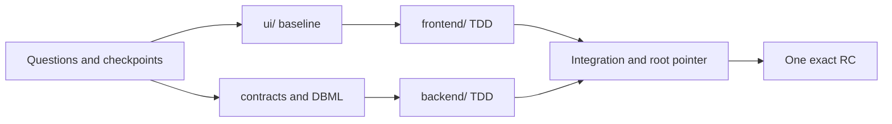

# Stackcord

> A question-driven collaboration harness that connects the right development practices and collaboration tools and keeps full-stack project context coherent through release.

[한국어](./README.ko.md)

Stackcord is a **Question-Driven Development (QDD)** tool used through conversations with Codex. It does not force a technology stack before the service is understood. It records users, policies, and failure behavior, then coordinates `ui/`, `frontend/`, and `backend/` as one product even when they are separate repositories.

Users do not memorize commands. In Codex, say “Start a new service with me,” “Build this feature,” or “Continue this project.” Stackcord Skills own questions and judgment; an internal deterministic verifier checks actual Git, submodule, conflict, and release state.

## What problems does it solve?

| Common problem | With Stackcord |
| --- | --- |
| People and AI understand the service differently | Product purpose, policies, scenarios, contracts, and decisions become a shared repository source so any contributor or AI works from the same basis. |
| The AI forgets settled decisions during a long discovery conversation | Each material answer becomes a product summary, policy, decision, or open question. |
| Security, accessibility, operations, authorization, or failure recovery is omitted because nobody thought of it | Stackcord checks coverage gaps and raises only questions that materially change the product. |
| The team rebuilds a capability because it did not know a Skill, Plugin, practice, or external tool already existed | Stackcord inspects the current need and available tools, explains realistic candidates, and connects only the selected one. |
| Separate `ui/`, `frontend/`, and `backend/` repositories drift into different products | The orchestration root owns shared meaning, contracts, baselines, integration order, and the exact commit set. |
| An ordinary implementation change silently changes product direction | Contributors may propose a change, but only assigned product authorities can approve policies, contracts, and business rules. |
| Different files change the same policy, contract, database entity, or UI flow | Stackcord detects semantic overlap before work starts and requires ownership and merge order. |
| Unclear ownership causes duplicate implementation or late integration conflicts | Executable checklists and semantic scope are connected to a proportional Git reservation. |
| A clone, AI switch, or context compaction loses the current state and next work | Actual Git, submodules, canonical product sources, and fingerprints reconstruct both state and the next action. |

## Use it through Codex

Start in a Codex conversation with the Plugin installed. Stackcord asks one material question at a time.

```text
User: Start a reservation service with me.

Stackcord: First, how does a reservation become confirmed?

A. An administrator approves it (Recommended)
B. Successful payment confirms it automatically
C. The request confirms immediately
You can also provide free-form input.

User: A

Stackcord: I recorded administrator approval as the confirmation policy.
Next, we should decide what happens if another user takes the slot before approval.
```

| What the conversation establishes | Stored result |
| --- | --- |
| Service purpose, users, and key journeys | Normalized product meaning under `specs/` |
| “Confirm after administrator approval” | Service policy and decision |
| Double booking or payment failure | Success and failure scenarios |
| Important unanswered decisions | Open questions |

Raw conversation and speaking style are not stored. Only development-relevant meaning is normalized so another clone can recover the same basis.

Product direction can be protected separately.

```text
Contributor: Change the refund window to 24 hours before the booking.

Stackcord: This changes service policy and the refund contract.
Your current Git account is not a product authority, so I can prepare the proposal, tests, and implementation but cannot approve it.
I can open a PR in the selected Git provider and request a product-authority review.
```

Git display names and email addresses are mutable, so they never grant authority. A real account in the selected Git provider must approve the exact commit. If protected policy or contract meaning changes afterward, the previous approval becomes stale.

## From questions to release

| Stage | What the user says | What Stackcord does |
| --- | --- | --- |
| Start | “Start a service” or “Adopt this project” | Reads files, Git, and existing configuration, then starts non-destructively. |
| Define | Answer a choice or use free-form input | Checkpoints product meaning, policies, and scenarios after each material answer. |
| Design | “Define the UI first” | Establishes role/journey UI coverage and contract/DBML boundaries. |
| Plan | “Build account recovery” | Defines the checklist, TDD order, ownership scope, and merge order. |
| Implement | Continue with natural-language requests | Delivers small changes and integrates contracts, migrations, and pointers in dependency order. |
| Recover | “Continue this project” | Reconstructs context from actual repositories and proposes one safe next action. |
| Release | “Prepare the release” | Binds technical evidence and user approval to the same candidate. |



This is not a waterfall process. Stackcord first understands whole-product roles, journeys, and UI coverage, then continuously integrates small role, domain, and journey slices.

## It recommends practices and collaboration tools when needed

Stackcord does not recreate Superpowers, BMAD, or Beads. When a real need appears, it inspects the repository and available tools, compares realistic options, and connects only the user's choice.

```text
User: Three people will split frontend and backend development.

Stackcord: This repository already uses GitHub, so we should select one live task source.

A. GitHub Issues + Git reservation (Recommended) — visible ownership and status in GitHub
B. Beads + Git reservation — useful for a complex distributed dependency graph
C. Git-local — lightweight and requires no hosted task service

User: A

Stackcord: GitHub Issues will own visible status. Stackcord will reserve policy, contract, DB, and UI scope.
```

| Need | Possible choice | Stackcord still owns |
| --- | --- | --- |
| Design, TDD, debugging, and review discipline | Superpowers | Service meaning and actual repository state |
| Formal roles, PRDs, and story-driven delivery | BMAD | Git/submodule truth, contracts, and release identity |
| Task status and dependencies | Git-local, GitHub Issues, Jira, Beads | Executable checklist and semantic reservation |
| UI creation and collaboration | Figma, Penpot, UI Skills | Approved `ui/` commit and frontend baseline |
| Database visualization | dbdiagram CLI | Git DBML, migration, and rollback evidence |

## Core capabilities

| Situation | What Stackcord does | Result |
| --- | --- | --- |
| New or existing project | Framework-neutral init/adopt | A harness that preserves existing files |
| Long discovery conversation | Normalized checkpoint after each material answer | Less repeated questioning and context loss |
| Technology decision | Compares product, quality, team, operations, and current official evidence | A dated decision with reasons and a review trigger |
| External UI mockup | Classifies authority as reference, seed, or canonical and imports all or selected files | Editable UI workspace with provenance |
| Contract or database change | Checks providers, consumers, failures, DBML, and migration impact | Explicit compatibility and implementation order |
| Product policy or business-rule change | Verifies an assigned product authority and exact commit through the selected Git provider | Contributors can propose while unapproved direction changes remain blocked |
| Concurrent work | Selects a worktree and reserves semantic scope with compare-and-swap | Fewer duplicate implementations and silent conflicts |
| Clone, pause, or compaction | Recomputes stable IDs, fingerprints, and actual Git state | Confirmed, stale, and unknown context |
| Release preparation | Combines TDD evidence, pointers, contracts, migrations, and user approval | One verifiable candidate |

## Git and submodule collaboration

```text
project/                  # orchestration root: product meaning and integration commit
├── ui/                   # optional UI directory or submodule
├── frontend/             # independent product repository/submodule
├── backend/              # independent product repository/submodule
├── specs/
├── contracts/registry.yaml
└── .harness/
```

| Collaboration point | Safety behavior |
| --- | --- |
| Before work starts | Inspect branch, dirty state, ahead/behind, divergence, worktrees, and submodules. |
| When work might overlap | Compare paths, policies, scenarios, contracts, DB entities, UI flows, dependencies, and pointers. |
| When overlap is detected | Agree on ownership, boundaries, or merge order before implementation starts. |
| After child work finishes | Review the child commit before updating the root submodule pointer. |
| After another contributor clones | Run `git submodule update --init --recursive`, then let Stackcord recover combined state. |

Branches and commits follow ordinary conventions such as `feature/account-recovery` and `feat(account): add recovery challenge`. Names do not contain AI, agent, or model markers.

## Installation

End users do not need Go or internal CLI knowledge. Paste this repository's GitHub URL into Codex and ask:

```text
Install the Stackcord Plugin from this GitHub link and prepare to start this project.
<Stackcord GitHub URL>
```

Codex can configure the marketplace and installation. Complete the security confirmation if prompted, then start a new conversation and say, “Start a new service with me.”

Use the manual fallback only when needed:

```bash
codex plugin marketplace add <owner>/stackcord
```

Then install Stackcord from **Plugins** in Codex. A generated repository can continue without the Plugin through `.agents/skills/use-project-harness/` and its Markdown fallback.

## Generated files and modes

| Path | Role |
| --- | --- |
| `specs/` | Product summaries, policies, scenarios, decisions, and open questions |
| `contracts/registry.yaml` | Cross-component obligations, failures, and provider/consumer relationships |
| `.harness/workspaces.yaml` | Root, UI, frontend, and backend topology |
| `.harness/work/provider.yaml` | The one selected live task source |
| `.harness/governance.yaml` | Assigned product authorities and protected product meaning |
| `.harness/local/context/` | Ignored, reproducible context cache |
| `.agents/skills/use-project-harness/` | Repo-local Skill for Plugin-less continuation |

The five user-facing Skills are `start-project`, `continue-project`, `plan-project-work`, `coordinate-project-work`, and `recover-and-release-project`. Users do not need to memorize their names.

Core mode provides account-based product authority, TDD, conflict and integration checks, applicable migration/rollback evidence, and exact-candidate verification. `strict-release` adds SBOM, provenance, signatures, and multi-party or signed approvals only when explicitly selected.

## Learn more

| What you want to do | Guide |
| --- | --- |
| Start or adopt a project | [Getting started](./docs/getting-started/en.md) |
| Collaborate across UI, frontend, and backend | [UI workspace](./docs/guides/ui-workspace-en.md) · [Submodules](./docs/guides/submodules-en.md) |
| Manage work, conflicts, and product authorities | [Task management](./docs/guides/task-management-en.md) · [Product authority](./docs/guides/governance-en.md) |
| Design the database and prepare a release | [DBML](./docs/guides/dbdiagram-en.md) · [Release](./docs/guides/release-en.md) |
| Troubleshoot a problem | [Troubleshooting](./docs/guides/troubleshooting-en.md) |
