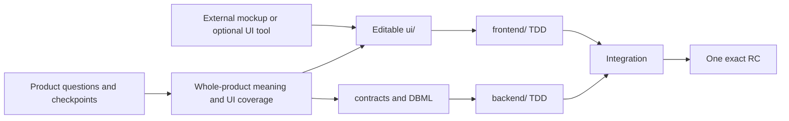

# Full-stack Project Harness

> The public name will be selected before release. The current package is Codex-first.

[한국어](./README.ko.md)

Define a service with an AI in natural language, create and connect framework-neutral `ui/`, `frontend/`, and `backend/` repositories, and let another clone continue from exact project state through release.

## What changes when you use it

- Long product conversations continuously become normalized summaries, policies, scenarios, decisions, and open questions.
- External mockups can become editable work in `ui/`, while frontend implementation binds to an exact approved UI commit.
- Git, submodules, worktrees, and work reservation reveal both file and semantic collisions across policy, contracts, data, and UI.
- A clone or compacted context can reconstruct actual state and verify the same release candidate.

## How to use it

Speak to Codex instead of memorizing commands.

```text
“Start a new service with me.”
“Adopt this existing project and understand its current state.”
“Continue this project. What should I do next?”
```

Skills own conversation and judgment. The Go CLI deterministically verifies actual Git state, identity, safety, and conflicts.



## Core capabilities

| Capability | Effect |
| --- | --- |
| Discovery checkpoints | Store normalized product meaning rather than raw conversation and ask one material question at a time. |
| Framework-neutral start and adoption | Create a new project or add the harness without overwriting an existing repository. |
| Editable UI workspace | Classify mockups as `reference`, `seed`, or `canonical`, then bring in all or selected material for editing. |
| Git collaboration diagnosis | Inspect branches, dirtiness, ahead/behind, divergence, worktrees, submodule HEADs, and root pointers. |
| Semantic collision and reservation | Detect overlap in paths, policies, scenarios, contracts, DB entities, migrations, UI flows, dependencies, and pointers. |
| Contracts and DBML | Manage service obligations and failure behavior while comparing canonical Git DBML with isolated dbdiagram proposals. |
| Context recovery | Recompute confirmed, stale, and unknown state from stable IDs and fingerprints after clone, pause, or compaction. |
| Exact release | Bind technical and user verification to one root/UI/frontend/backend candidate. |

There are only five user-facing Skills: `start-project`, `continue-project`, `plan-project-work`, `coordinate-project-work`, and `recover-and-release-project`.

## Start locally in five minutes

Go 1.26 or newer is required.

```bash
cd cli
go test ./...
go build -o ../bin/orchestrator ./cmd/orchestrator
cd ..
./bin/orchestrator doctor --json
```

Windows PowerShell:

```powershell
cd cli
go test ./...
go build -o ..\bin\orchestrator.exe .\cmd\orchestrator
cd ..
.\bin\orchestrator.exe doctor --json
```

To add the Codex Plugin as a local marketplace, run this, restart Codex, and install it from Plugins:

```bash
codex plugin marketplace add /absolute/path/to/fullstack-orchestrator
```

A generated repository can continue without the Plugin through `.agents/skills/use-project-harness/` and its Markdown fallback.

## Proportional verification

- During development, run only the changed Go package or relevant Python validator.
- Pull requests run the full Go suite on macOS ARM and Windows x64, with fast validators, dogfood, and four-target cross-builds in parallel.
- Race and fuzz checks do not repeat on every pull request; they run in scheduled security checks and release verification.
- CI and normal release never invoke actual Codex. Select one explicit scenario only when Skill behavior changes.

```bash
python3 scripts/run_agent_eval.py \
  --scenarios evals/agent-behavior/scenarios.yaml \
  --rubric evals/agent-behavior/rubric.yaml \
  --output .harness/local/evals/skill-change \
  --scenario continue-after-clean-clone
```

All nine scenarios require both `--all --allow-external-research`. Use the external-tool research scenario only when the project actually needs a tool decision. Model drills consume AI tokens and are not an automatic CI gate.

## Real project flow

1. Diagnose repositories and tools, then checkpoint material product answers.
2. Establish whole-product roles, journeys, and UI coverage while integrating small role/domain/journey changes continuously.
3. When useful, add an existing remote as the `ui/` submodule and register the workspace.
4. Inspect an external mockup, bring all or selected files into `ui/`, and edit them as ordinary files.
5. Publish the UI commit, bind it as a baseline, and make `frontend/` work reference that exact fingerprint.
6. Agree on shared contracts and DBML boundaries, then implement frontend and backend behavior with TDD.
7. Review child commits, integrate root pointers, and validate one candidate technically and with the user.

UI Skills such as MengTo/Skills, Figma, Penpot, Superpowers, BMAD, GitHub Issues, Jira, and Beads can be selected when useful. They can help create artifacts or manage live task status, but they do not replace canonical service meaning or release identity.

## Generated core structure

```text
project/
├── specs/                         # product meaning, policies, scenarios
├── contracts/registry.yaml        # service obligations and provider/consumer links
├── ui/                            # optional editable UI directory/submodule
├── frontend/                      # production frontend
├── backend/                       # production backend
├── .agents/skills/use-project-harness/
└── .harness/
    ├── workspaces.yaml
    ├── work/provider.yaml
    ├── ui/baselines/
    └── local/context/             # ignored, reproducible cache
```

Users rarely edit `.harness/` directly; the AI summarizes state and plans safe changes. Collaborative Git uses ordinary conventions such as `feature/account-recovery` and `feat(account): add recovery challenge`. Branch and commit names never include AI markers.

The reproducible context cache lives at the ignored `.harness/local/context/` path.
The selected live task source is recorded at `.harness/work/provider.yaml`.

## Core mode and strict release

Core mode keeps ordinary teams to Git identity, TDD, integration, applicable migration/rollback evidence, and one exact candidate. `strict-release` adds SBOM, provenance, signatures, and stronger approvals only when an organization explicitly selects it.

## Detailed guides

- [Getting started](./docs/getting-started/en.md)
- [UI workspace and external mockups](./docs/guides/ui-workspace-en.md)
- [Submodules and collaboration](./docs/guides/submodules-en.md)
- [Task management and work reservation](./docs/guides/task-management-en.md)
- [DBML and dbdiagram](./docs/guides/dbdiagram-en.md)
- [Release](./docs/guides/release-en.md)
- [Troubleshooting](./docs/guides/troubleshooting-en.md)

Before public release, the remaining choices are the final name and identifiers, public repository/account, signing ownership if needed, and authorization for irreversible publication.
