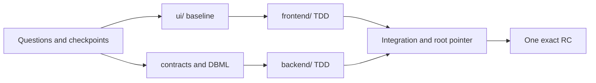

# Stackcord

> A full-stack collaboration harness that defines services through questions and keeps many repositories and contributors aligned around one product context.

[한국어](./README.ko.md)

Stackcord is a **Question-Driven Development (QDD)** tool used through conversations with Codex. It does not pick a framework first. It understands users, policies, and failure behavior before recommending the technologies and collaboration tools the service actually needs.

Users do not memorize commands. Say “Start a new service,” “Build this feature,” or “Continue this project.” **Skills handle questions and judgment; a deterministic verifier checks actual Git, submodule, conflict, and release state.**

## What problems does it solve?

| Problem | With Stackcord |
| --- | --- |
| People and AI understand the service purpose, policies, and behavior differently | Purpose, policies, scenarios, contracts, and decisions become a shared repository source. |
| The AI forgets settled decisions or repeats questions during a long conversation | Each material answer updates product summaries, policies, decisions, and open questions. Raw dialogue and speaking style are not stored. |
| Security, accessibility, operations, authorization, and failure recovery are overlooked | Stackcord raises uncovered areas proactively, but asks only one product-changing question at a time. |
| The team rebuilds something because it did not know an existing Skill, Plugin, practice, or external tool | Stackcord inspects the need and available tools, explains the differences, and connects only the selected option. |
| Separate `ui/`, `frontend/`, and `backend/` repositories drift into different products | An orchestration root manages shared meaning, contracts, integration order, and the exact commit set. |
| An ordinary implementation change silently changes product direction | Contributors may propose changes, but only assigned product authorities approve policies, contracts, and business rules. |
| Different files change the same policy, database entity, or UI flow | Stackcord checks overlap in product meaning, not only file paths, before work starts. |
| Unclear ownership causes duplicate work or conflicts just before integration | Checklists are connected to work scope, and only the required semantic scope is reserved in Git. |
| A clone, AI switch, or context compaction loses current state and next work | Actual Git, submodules, product sources, and fingerprints reconstruct both state and the next action. |

## What does using it look like?

### 1. Define the service through questions

```text
User: Start a reservation service with me.
Stackcord: First, how does a reservation become confirmed?
A. An administrator approves it (Recommended)
B. Successful payment confirms it automatically
C. The request confirms immediately
You can also provide free-form input.

User: A
Stackcord: I recorded administrator approval. Next, we should decide what happens if the slot is taken before approval.
```

Answers are normalized as product meaning under `specs/`. Technology choices come later, once product, quality, team, and operational constraints are clear, and are checked against current official documentation and maintenance status.

### 2. Recommend external tools when they become useful

```text
User: Three people will split frontend and backend development.
Stackcord: This project already uses GitHub, so we should select one live task source.
A. GitHub Issues + Git reservation (Recommended)
B. Beads + Git reservation
C. Git-local

User: A
Stackcord: GitHub Issues will own assignment and status. Stackcord will manage policy, contract, database, and UI conflict scope.
```

Stackcord does not recreate Superpowers, BMAD, or Beads. **It finds an appropriate tool when the user needs it, including tools the user did not know about, and keeps that tool from taking over the project's source of truth.** Unselected tools are never forced on the project.

### 3. Let only approved people confirm product direction

```text
Contributor: Change the refund window to 24 hours before the booking.
Stackcord: This changes service policy and the refund contract.
Your current account is not a product authority, so I can prepare the proposal, tests, and implementation but cannot approve it.
I can open a PR in the selected Git provider and request product-authority review.
```

Local Git names and email addresses never grant authority. A real account in the selected Git provider must approve the exact commit. If protected meaning changes, the previous approval becomes stale.

## From questions to release

| Flow | What Stackcord does |
| --- | --- |
| Start or adopt | Creates a framework-neutral project or adopts an existing repository without overwriting it. |
| Discover the product | Checkpoints purpose, roles, journeys, policies, and success/failure behavior after each material answer. |
| UI and design | Establishes whole-product UI coverage, then splits work by role, domain, and journey. External mockups are imported as reference, seed, or canonical input. |
| Contracts and database | Defines business rules, component contracts, failures, Git-owned DBML, and migration/rollback boundaries. |
| Plan and implement | Sets checklists, ownership, and merge order, then uses TDD for behavior, bugs, contracts, migrations, and UI interactions. |
| Integrate and recover | Reviews child commits before updating root pointers and reconstructs state after a clone or context compaction. |
| Release | Verifies that technical evidence and user confirmation refer to the same release candidate. |



This is not waterfall delivery. The team shares whole-product meaning and UI coverage first, but implementation stays in small changes that are integrated continuously.

## Git and submodule collaboration

```text
project/                  # orchestration root: product meaning and integration commit
├── ui/                   # optional UI directory or submodule
├── frontend/             # independent repository/submodule
├── backend/              # independent repository/submodule
├── specs/                # purpose, policies, scenarios, and decisions
├── contracts/            # business, behavior, interface, and data agreements
└── .harness/             # verifiable collaboration state
```

| Collaboration point | What is checked |
| --- | --- |
| Before work starts | Branch, dirty state, ahead/behind, divergence, worktrees, submodules, and existing reservations. |
| During concurrent work | Overlap in paths, policies, scenarios, contracts, DB entities, migrations, UI flows, dependencies, and pointers. |
| When conflict risk appears | Ownership, implementation boundaries, and merge order are set first, or the work is isolated in a worktree. |
| After child work finishes | The child commit is reviewed before the root-recorded submodule pointer changes. |
| After another contributor clones | Stackcord recovers shared sources, actual Git state, and remaining work after submodules are initialized. |

Branches and commits use ordinary Git conventions such as `feature/account-recovery` and `feat(account): add recovery challenge`. Names do not include AI, agent, or model markers.

## What does it actually verify?

| Verification area | Problems it blocks |
| --- | --- |
| Git and submodules | Dirty or diverged repositories, missing children, and root-pointer/child-HEAD mismatch |
| Work and conflicts | Duplicate reservations, stale state, semantic conflicts across different files, and unsafe merge order |
| Product sources | Changed policies, contracts, DBML, or UI flows and stale or unauthorized approvals |
| Development evidence | Missing TDD red/green evidence, contract consumers, migrations, or rollback evidence |
| Release | Technical and user approval of different commits or a candidate changed after verification |

Stackcord does not treat AI judgment as fact; it verifies state that can be recomputed from repositories. Actual merge authorization is still enforced by branch protection and CODEOWNERS in a Git provider such as GitHub or GitLab.

## Installation

You do not need to know Go or the internal CLI. Paste the public Stackcord GitHub repository link into Codex and ask:

```text
Install the Stackcord Plugin from this GitHub repository and prepare the current project.
```

Approve the security prompt if one appears, then start a new conversation and say, “Start a new service with me.” Use `codex plugin marketplace add <owner>/stackcord` only when manual installation is necessary.

A generated project can continue in another Codex environment without the Plugin through its repo-local Skill and Markdown fallback.

## Main files added to a project

| Path | Contents |
| --- | --- |
| `specs/` | Product summaries, policies, scenarios, decisions, and open questions |
| `contracts/` | Service rules and cross-component business, behavior, interface, and data agreements |
| `.harness/workspaces.yaml` | Root, UI, frontend, and backend repository topology |
| `.harness/work/` | Selected task source, checklists, work scope, and reservations |
| `.harness/governance.yaml` | Product authorities and protected product meaning |
| `.harness/local/` | Reproducible local observations and context cache excluded from Git |
| `.agents/skills/use-project-harness/` | Repo-local Skill for continuing without the Plugin |

The user-facing Skills are consolidated into five roles: start, continue, plan work, coordinate collaboration, and recover/release. Users do not memorize their names. Core mode provides the checks ordinary teams need; `strict-release` adds stronger supply-chain controls such as SBOM, provenance, and signatures only for organizations that select it.

## Learn more

| What you want to do | Guide |
| --- | --- |
| Start or adopt a project | [Getting started](./docs/getting-started/en.md) |
| Collaborate across UI, frontend, and backend | [UI workspace](./docs/guides/ui-workspace-en.md) · [Submodules](./docs/guides/submodules-en.md) |
| Manage work, conflicts, and product authorities | [Task management](./docs/guides/task-management-en.md) · [Product authority](./docs/guides/governance-en.md) |
| Design the database and prepare a release | [DBML](./docs/guides/dbdiagram-en.md) · [Release](./docs/guides/release-en.md) |
| Troubleshoot a problem | [Troubleshooting](./docs/guides/troubleshooting-en.md) |
