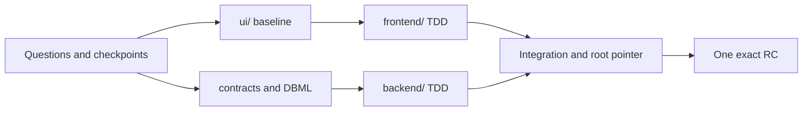

# Stackcord

> Keep people, AI agents, and repositories working from the same product decisions.

[](https://github.com/kcrmin/Stackcord/actions/workflows/ci.yml)
[](./LICENSE)
[](https://github.com/kcrmin/Stackcord/releases/latest)


[한국어](./README.ko.md)

Stackcord is an open-source full-stack collaboration harness: AI Skills guide **Question-Driven Development (QDD)**, and a Go CLI verifies the repository state. It turns conversations into durable product decisions, coordinates work across repositories, and recovers context when a session ends or another contributor takes over. It understands users, policies, and failure behavior before recommending a framework.

Users do not memorize commands. Say “Start a new service,” “Build this feature,” or “Continue this project.” **Skills handle questions and judgment; a deterministic verifier checks actual Git, submodule, conflict, and release state.**

[Quick start](#quick-start) · [Product flow](#from-questions-to-release) · [Documentation](#learn-more) · [Contributing](#development-and-contributing)

## Quick start

Paste [this repository link](https://github.com/kcrmin/Stackcord) into Codex and ask:

```text
Install the Stackcord Plugin from this GitHub link and prepare the current project.
```

Complete any installation security prompt, then start a new conversation. Manual installation of the published snapshot:

```bash
codex plugin marketplace add kcrmin/Stackcord --ref v1.0.0
codex plugin add stackcord@stackcord
```

In an empty parent directory, say **“Start a new service with me.”** In an existing repository, say **“Adopt this project without overwriting my files.”** Answer the product questions, then ask **“Audit the project context and tell me what is next.”** Accepted decisions become repository files, so another session can continue from them.

The tagged release is a fixed snapshot; this README also describes current `main`. For current source installation, CLI setup, platform bundles, and SHA-256 verification, follow [Getting started](./docs/getting-started/en.md). Hooks never download or install software. Generated projects retain a repo-local Skill and Markdown fallback for continuation without the Plugin.

## What problems does it solve?

| Problem | With Stackcord |
| --- | --- |
| People and AI understand the service differently | Purpose, policies, scenarios, contracts, and decisions become a shared repository source. |
| The AI forgets settled decisions or repeats questions during a long conversation | Each material answer updates product summaries, policies, decisions, and open questions. Raw dialogue and speaking style are not stored. |
| Security, accessibility, operations, authorization, and failure recovery are overlooked | Stackcord raises uncovered areas proactively, batches independent routine questions, and shows discovery progress. |
| The team rebuilds something because it did not know an existing Skill, Plugin, practice, or external tool | Stackcord inspects the need and available tools, explains the differences, and connects only the selected option. |
| Separate `ui/`, `frontend/`, and `backend/` repositories drift into different products | An orchestration root manages shared meaning, contracts, integration order, and the exact commit set. |
| An ordinary implementation change silently changes product direction | Contributors may propose changes, but only assigned product authorities approve policies, contracts, and business rules. |
| Different files change the same policy, database entity, or UI flow | Stackcord checks overlap in product meaning, not only file paths, before work starts. |
| Unclear ownership causes duplicate work or conflicts just before integration | Checklists are connected to work scope, and only the required semantic scope is reserved in Git. |
| A clone, AI switch, or context compaction loses current state and next work | Actual Git, submodules, product sources, and fingerprints reconstruct both state and the next action. |

## What does using it look like?

### 1. Define the service through questions

```text
User: I think we also need a reservation service.
Stackcord: First, how does a reservation become confirmed?
A. An administrator approves it (Recommended)
B. Successful payment confirms it automatically
C. The request confirms immediately
You can also provide free-form input.

User: A
Stackcord: I recorded administrator approval. Next, we should decide what happens if the slot is taken before approval.
```

Answers are normalized as product meaning under `specs/`. Technology choices come later, once product, quality, team, and operational constraints are clear, and are checked against current official documentation and maintenance status.

### 2. Recommend external tools when they become useful

```text
User: Three people will split frontend and backend development.
Stackcord: This project already uses GitHub, so we should select one live task source.
A. GitHub Issues + Git reservation (Recommended)
B. Beads + Git reservation
C. Git-local

User: A
Stackcord: GitHub Issues will own assignment and status. Stackcord will manage policy, contract, database, and UI conflict scope.
```

Stackcord does not recreate Superpowers, BMAD, or Beads. **It finds an appropriate tool when the user needs it, including tools the user did not know about, and keeps that tool from taking over the project's source of truth.** Unselected tools are never forced on the project.

These are conditional recommendations: Beads requires its own installed CLI; external task systems require a working authenticated connector or CLI. They are not bundled adapters. Git-local is the default.

### 3. Let only approved people confirm product direction

```text
Contributor: Change the refund window to 24 hours before the booking.
Stackcord: This changes service policy and the refund contract.
Your current account is not a product authority, so I can prepare the proposal, tests, and implementation but cannot approve it.
I can open a PR in the selected Git provider and request product-authority review.
```

Local Git names and email addresses never grant authority. A real account in the selected Git provider must approve the exact commit. If protected meaning changes, the previous approval becomes stale.

## From questions to release

| Flow | What Stackcord does |
| --- | --- |
| Start or adopt | Creates a framework-neutral project or adopts an existing repository without overwriting it. |
| Discover the product | Checkpoints purpose, roles, journeys, policies, and success/failure behavior after each material answer. |
| UI and design | Establishes whole-product UI coverage, then splits work by role, domain, and journey. External mockups are imported as reference, seed, or canonical input. |
| Contracts and database | Defines business rules, component contracts, failures, Git-owned DBML, and migration/rollback boundaries. |
| Plan and implement | Sets checklists, ownership, and merge order, then uses TDD for behavior, bugs, contracts, migrations, and UI interactions. |
| Integrate and recover | Reviews child commits before updating root pointers and reconstructs state after a clone or context compaction. |
| Release | Verifies that technical evidence and user confirmation refer to the same release candidate. |


```mermaid
flowchart LR
    Q["Questions and checkpoints"] --> U["ui/ baseline"] & C["contracts and DBML"]
    U --> F["frontend/ TDD"]
    C --> B["backend/ TDD"]
    F & B --> I["Integration and root pointer"]
    I --> R["One exact RC"]
```

This is not waterfall delivery. The team shares whole-product meaning and UI coverage first, but implementation stays in small changes that are integrated continuously.

### How are `specs/` and `contracts/` different?

`specs/` answers **what the product does and why**. For example, it records the product policy “A reservation is confirmed after administrator approval” and the reason for that decision.

`contracts/` defines **what every implementation must obey**. From the same policy, it requires a new reservation to be `pending` and allows only an authorized administrator's approval to change it to `confirmed`. In other words, `contracts/` turn the intent in `specs/` into testable promises shared by frontend and backend.

## Main files added to a project

| Path | Contents |
| --- | --- |
| `specs/` | Product summaries, policies, scenarios, decisions, and open questions |
| `contracts/registry.yaml` | Index of service rules and cross-component contracts |
| `.harness/workspaces.yaml` | Root, UI, frontend, and backend repository topology |
| `.harness/work/provider.yaml` | Selected live task status source |
| `.harness/governance.yaml` | Product authorities and protected product meaning |
| `.harness/git-conventions.yaml` | Optional repository rules for branch, commit, pull-request, and issue presentation |
| `.harness/local/context/` | Reproducible context cache excluded from Git |
| `.agents/skills/use-project-harness/` | Repo-local Skill for continuing without the Plugin |

The six user-facing Skills are `start-project`, `continue-project`, `plan-project-work`, `coordinate-project-work`, `recover-and-release-project`, and `use-git-conventions`. The Git-convention Skill records rules supplied by the developer and reuses them before creating or validating a branch, commit, pull request, or issue. Users do not memorize Skill names. Core mode provides the checks ordinary teams need; `strict-release` adds stronger supply-chain controls such as SBOM, provenance, and signatures only for organizations that select it.

## Supported environments and CLI

Release binaries target **macOS and Windows, x64 and ARM64**. CI runs native tests on macOS ARM64 and Windows x64 and cross-builds all four targets. Git is needed for repository collaboration; Go is only needed for source builds. Codex is the primary conversational entry point; Claude manifests and hook adapters share the same CLI and project files. Package validation does not guarantee every host version's session behavior.

After [setting up the CLI](./docs/getting-started/en.md), these commands expose the same evidence used by the Skills:

| Command | Purpose |
| --- | --- |
| `stackcord doctor --json` | Inspect Git and optional local capabilities |
| `stackcord context audit --root . --json` | Check the current project's context against repository evidence |
| `stackcord project discovery --root . --json` | Read saved discovery decisions and progress |
| `stackcord dashboard --root .` | Open the optional local control center |

The dashboard serves a loopback browser UI with no Node runtime or hosted account. It shows discovery, GitHub Issues and PR links, review requests, settings, and diagnostics; stopping the command ends the session. Optional [peer communication](./docs/guides/peer-coordination-en.md) connects explicitly trusted workers across computers through signed requests and replies, using selected local Codex, Claude, or custom runners.

## Design and safety boundaries

Skills interpret intent; the CLI checks actual state. Committed `specs/`, `contracts/`, and `.harness/` preserve decisions and coordination rules; generated local caches are disposable. A provider outage or stale review produces unknown or stale evidence, not approval.

Product governance must be configured explicitly. Stackcord checks approval for protected meaning, while Git provider permissions and branch rules enforce merge restrictions. It cannot prevent a filesystem owner from editing files. Dashboard settings are working-tree proposals until committed and reviewed. `strict-release` is optional, and a verified candidate is not an automatic publication. See [governance](./docs/guides/governance-en.md), [threat model](./docs/security/threat-model-en.md), and [privacy](./docs/security/privacy-en.md).

## Development and contributing

Start with [CONTRIBUTING.md](./CONTRIBUTING.md) for source-build checks, review expectations, and contribution conventions. Explore the [Go CLI](./cli), [Skills](./skills), [project templates](./templates), and [starter example](./examples/starter). For README changes, run `python3 scripts/validate_docs.py` from the repository root; it checks documentation contracts and builds the CLI to verify documented commands.

Use [GitHub Issues](https://github.com/kcrmin/Stackcord/issues) for reproducible bugs and feature proposals, [SUPPORT.md](./SUPPORT.md) for help, and [SECURITY.md](./SECURITY.md) for vulnerability reporting. Project decision rules are in [GOVERNANCE.md](./GOVERNANCE.md).

## License

Stackcord is distributed under the [Apache License 2.0](./LICENSE).

## Learn more

| What you want to do | Guide |
| --- | --- |
| Start or adopt a project | [Getting started](./docs/getting-started/en.md) |
| Collaborate across UI, frontend, and backend | [UI workspace](./docs/guides/ui-workspace-en.md) · [Submodules](./docs/guides/submodules-en.md) |
| Manage work, conflicts, and product authorities | [Task management](./docs/guides/task-management-en.md) · [Product authority](./docs/guides/governance-en.md) |
| Design the database and prepare a release | [DBML](./docs/guides/dbdiagram-en.md) · [Release](./docs/guides/release-en.md) |
| Troubleshoot a problem | [Troubleshooting](./docs/guides/troubleshooting-en.md) |
